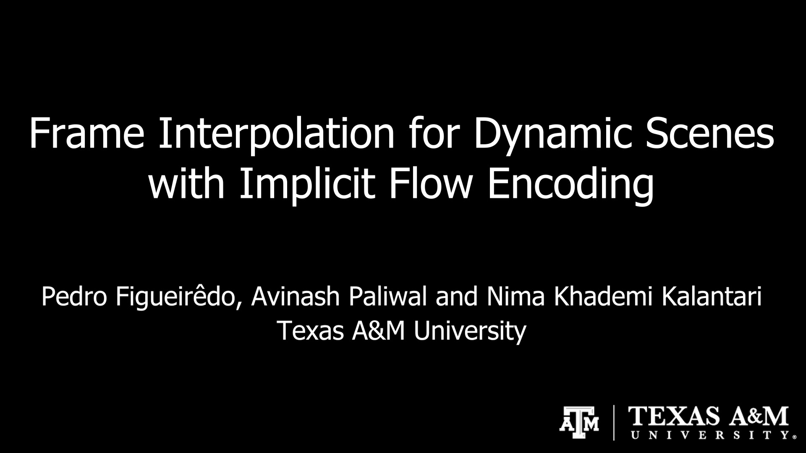

# Frame Interpolation for Dynamic Scenes with Implicit Flow Encoding

### [Project](https://people.engr.tamu.edu/nimak/Papers/WACV2023_Interp) | [Paper](https://arxiv.org/pdf/2209.13284) | [Supplementary](https://people.engr.tamu.edu/nimak/Papers/WACV2023_Interp/media/WACV2023_Interp_supp.pdf) | [YouTube](https://youtu.be/Re_c-CBlSfI) <br>

Official PyTorch implementation of our frame interpolation architecture. We leverage pre-trained [RAFT](https://github.com/princeton-vl/RAFT) to generate the flows we use as input to our Flow Decoder. Then, we combine the two warped images and their features using [FILM](https://github.com/google-research/frame-interpolation)'s pre-trained blending network. Our method is robust to lighting variation, being a per-scene optimization alternative to challenging dynamic scenes.<br>

[Frame Interpolation for Dynamic Scenes with Implicit Flow Encoding](https://arxiv.org/abs/2209.13284) <br />
[Pedro Figueirêdo](http://people.tamu.edu/~pedrofigueiredo/), [Avinash Paliwal](http://people.tamu.edu/~avinashpaliwal/), [Nima Khademi Kalantari](https://people.engr.tamu.edu/nimak/index.html)<br />
Texas A&M University<br />
In WACV 2023


FrameintIFE interpolates challenging near-duplicate photos, creating a slow motion video that depicts the natural transition between them.

## Installation

### We have tested this project with Ubuntu 22.04 and Python 3.9.13.

*   Clone this repository and its submodules

```
git clone --recurse-submodules https://github.com/pedrovfigueiredo/frameintIFE frameintIFE
cd frameintIFE
```

*   Set up an [anaconda](https://www.anaconda.com/) environment
```
conda create -n frameintIFE python=3.9.13
conda activate frameintIFE
```

*   Install Tensorflow and its dependencies
```
conda install -c conda-forge cudatoolkit=11.2 cudnn=8.1.0
export LD_LIBRARY_PATH=$LD_LIBRARY_PATH:$CONDA_PREFIX/lib/
pip install -r requirements-tf.txt
```

*   Install Pytorch and its dependencies
```
conda install pytorch==1.11.0 torchvision==0.12.0 torchaudio==0.11.0 cudatoolkit=11.3 -c pytorch
conda install opencv=4.6.0 tensorboardx=2.2 -c conda-forge
```

*   Apply changes to submodule pytorchmeta before installing it

```
cd lib/pytorch-meta
git checkout d55d89ebd47f340180267106bde3e4b723f23762
git apply ../../diffs/pytorch-meta.diff
python setup.py install
```

## Pre-trained Models

*   We use the [sintel checkpoint for RAFT](https://drive.google.com/drive/folders/1sWDsfuZ3Up38EUQt7-JDTT1HcGHuJgvT?usp=sharing) and the [style checkpoint for FILM](https://drive.google.com/drive/folders/1q8110-qp225asX3DQvZnfLfJPkCHmDpy?usp=sharing). We also provide [pre-trained weights of the Flow Decoder](https://drive.google.com/drive/folders/1cHg5Qj0g08I6jkQTkhjXii4qbeZmwCLC?usp=share_link) for the sample data.
*   Download the required weights from each google drive source, placing them into a newly created directory `<pretrained_models>`.

## Running the Codes

The following instructions demonstrate the frame interpolation of sample data stored in frameintIFE/sample_data.

### Generating RAFT reference flows

RAFT requires significant GPU memory for higher resolution images. Choose the `<factor>` argument to adjust the sample data resolution (originally 4K) according to your memory allowance. A factor of 0.25 is viable with a Nvidia RTX 3080 (10GB). For the paper, we use a factor of 0.5 on a Nvidia A100.

```
python RAFT/generateGTs.py --model <pretrained_models>/raft-sintel.pth --path sample_data/baby --output_path sample_data_out/baby --factor 0.25
```
Flows and images will be placed into `<output_path>`.


### Optimizing Flow Decoder

We provide [pre-trained weights for the Flow Decoder](https://drive.google.com/drive/folders/1cHg5Qj0g08I6jkQTkhjXii4qbeZmwCLC?usp=share_link) for the sample data scenes. Alternatively, you may optimize the flow decoder yourself by following the instructions below.

The number of optimization steps needed for a high-quality interpolation vary depending on the scene and its resolution. For all scenes shown on the paper and supplementary video, we use 10K iterations at a learning rate of 1e-6.

Optionally, you may set a `<savepath>` to get intermediate evaluations during the optimization, including flows and warped frames.

Execute the following command to optimize the Flow decoder, getting a continous representation of the RAFT flows generated on the previous step.

```
python optimize_decoder.py --f_left <output_path>/f42.pt --f_right <output_path>/f24.pt --siren_usebias --hyp_usebias --save_on_flow_dir
```

### Generating final frames

To generate final blended frames, we first query our continous flow representation at intermediate $t \in [0.0, 1.0]$. To match FILM's recursive interpolation timestamps, we use a `<interp_size>` argument, as follows: 

```
python discretize.py --dir <output_path> --interp_size 5 --siren_usebias --hyp_usebias
```

However, you can modify the input $t$ in the discretization code to generate any timestamp. This step generates a `flows.npy` file containing discretized flow values under `<output_path>`.

Now, we can use FILM's blending network to generate the final frames and accompanying video.

Run the following command to execute a modified version of FILM's blending network which uses our flows. Optionally, you may generate FILM's original results by omitting the `insert_flows` option. You may also add the `output_detailed` option to output both warped images and flows.

```
python -m FILM.eval.interpolator_cli --pattern <output_path> --model_path <pretrained_models>/film_net/Style/saved_model --times_to_interpolate 5 --insert_flows --output_video
```

Note: FILM's results worsen as the image resolution increases. Therefore, when comparing lower resolution interpolations (e.g. 1K resolution as a result of a factor of 0.25 during RAFT pre-processing), you may see less obvious artifacts than the reported in the paper. We suggest a per-frame comparison in these cases.

## Supplementary Video
[](https://youtu.be/Re_c-CBlSfI)


## Citation
```
@InProceedings{Figueiredo_2023_WACV,
    author    = {Figueir\^edo, Pedro and Paliwal, Avinash and Kalantari, Nima Khademi},
    title     = {Frame Interpolation for Dynamic Scenes With Implicit Flow Encoding},
    booktitle = {Proceedings of the IEEE/CVF Winter Conference on Applications of Computer Vision (WACV)},
    month     = {January},
    year      = {2023},
    pages     = {218-228}
}
```

## Acknowledgments

We would like to thank Ben Figueiredo, Carla Figueiredo, and Fernanda Gama for their contribution with the qualitative scenes.
